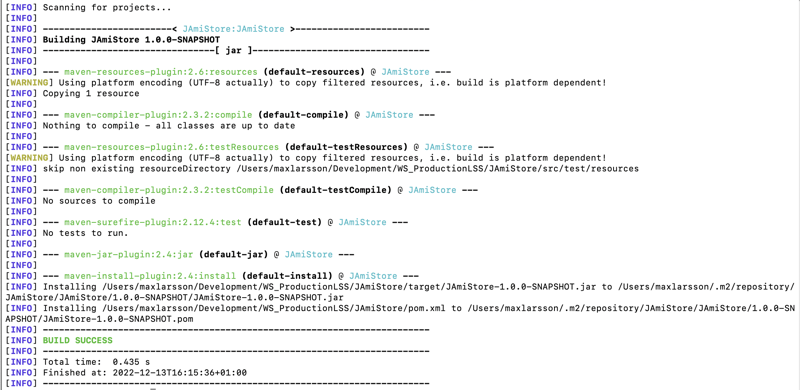
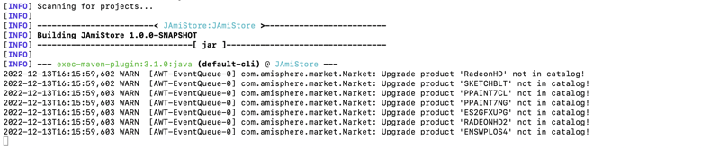
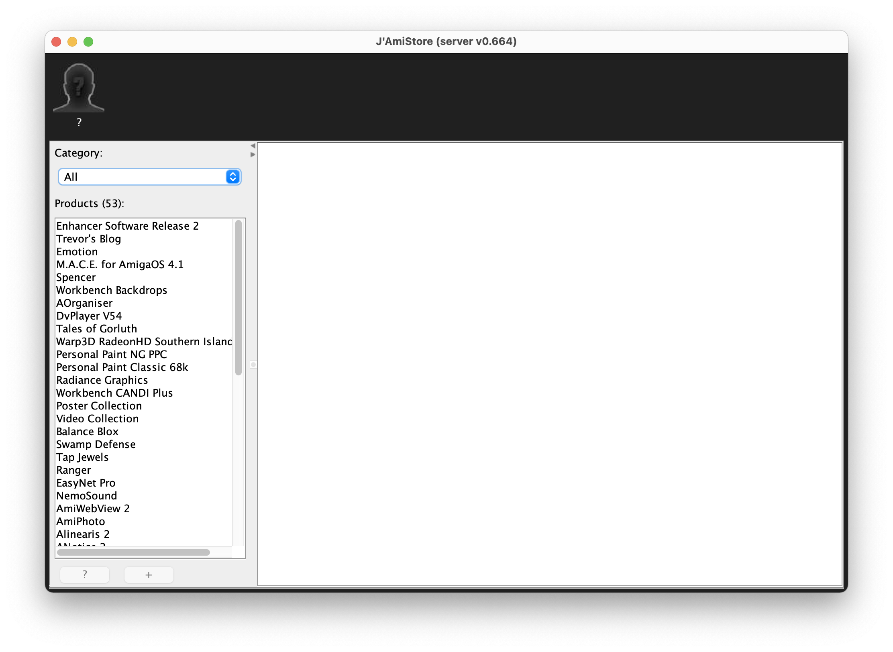
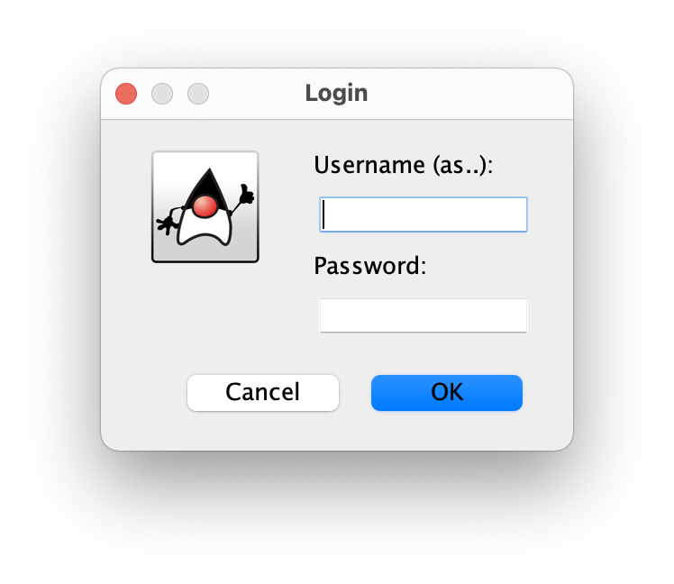
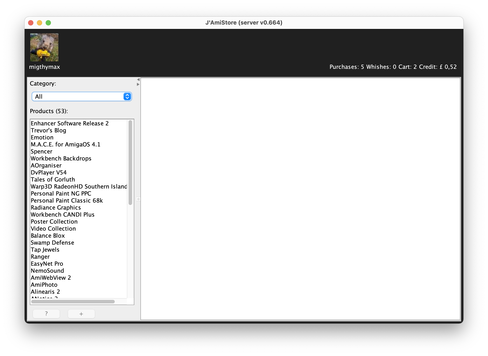
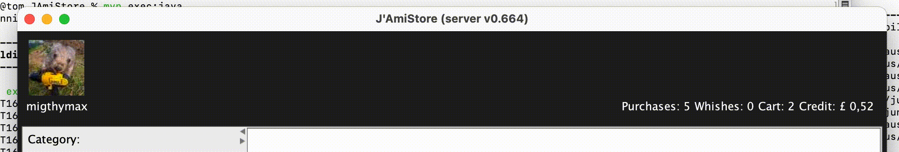
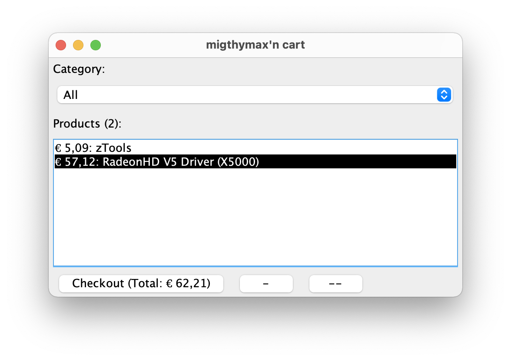
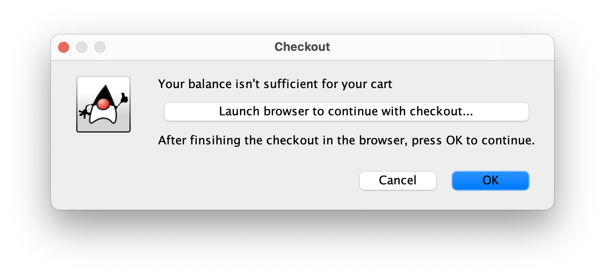

# J'AmiStore

## Overview & Motivation

This is an implementation of the Amiga AmiStore application in Java. The reason for implementing a clone is, because the Amiga native app didn’t let me login. (So I couldn’t buy anything.) Nobody could help me resp. tell why I cannot log in. Thus I helped myself and went into the rapid hole black box analyzing the communication between the server and the application.

The result ins’t a feature complete relica. Furthermore it doesn’t bother to make it pretty with images from the offered products, etc. And it probably doesn’t behave well if errors are encounter. But nevertheless it fulfill my needs to buy stuff from the store. Maybe others can have use of it, too.

## Disclaimer

While I make every effort to deliver high quality products, I do not guarantee that J'AmiStore are free from defects. Our software is provided “as is," and you use the
software at your own risk.
I make no warranties as to performance, fitness for a particular purpose, or any other warranties whether expressed or implied.
No oral or written communication from or information provided by me shall create a warranty.
Under no circumstances shall I be liable for direct, indirect, special, incidental, or consequential damages resulting from the use, misuse, or inability to use this software, even if I have been advised of the possibility of such damages.

## Requirements

* Java at least 1.8
* Installed Maven

## Installation

There is no packages release. So if you want to use it, you need to clone it, compile it and run:

### Clone
```
git clone https://github.com/migthymax/JAmiStore.git
```

To be able compile and run it the following commands must be performed within the checkout directory JAmiStore.

### Compile:
```
mvn install
```
The result will be something like that:




### Run
```
mvn exec:java

```

The result will be something like that:



## Usage

Even that most parts of the application should be self explanatory, here a short explanation how to log in and access the shopping cart etc.

After starting the application, it will present a basic viewer, with an silhouette of an user and a question mark beneath it. The question mark, and the silhouette indicates that no user is logged in:



Clicking on the users silhouette will ever prompt for the login credentials, or if a user is logged in,logging him off. In this case the application prompts for the user name and password:



If a successful login could be performed the silhouette is changed to the configured avatar of the logged in user and information is shown about his purchases, wishes, shopping cart and balance:



Hovering over a text will indicate that you can click on it. Depending on the text it will show you your purchases, wishes or your content of your shopping cart. Clikcing on credit will let you change the currency used to display the prices:



Here is an example shopping cart:



And the checkout procedure:



